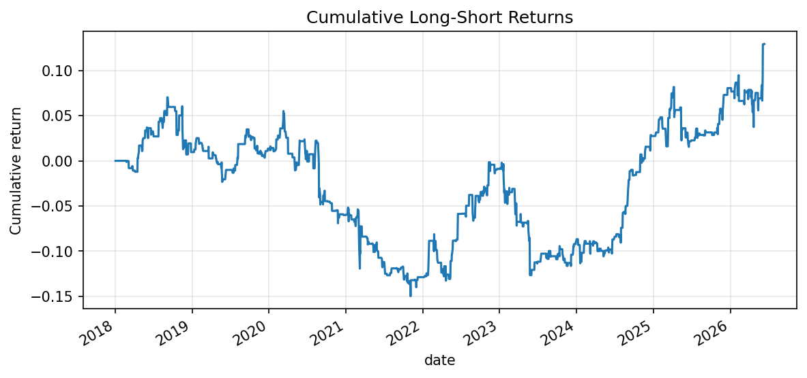
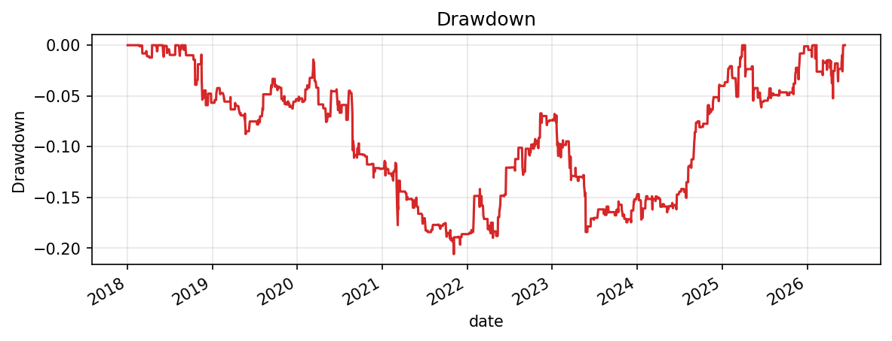
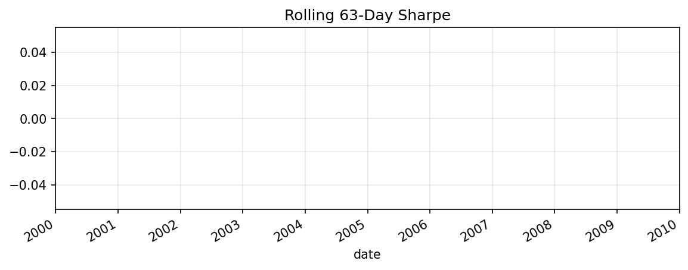
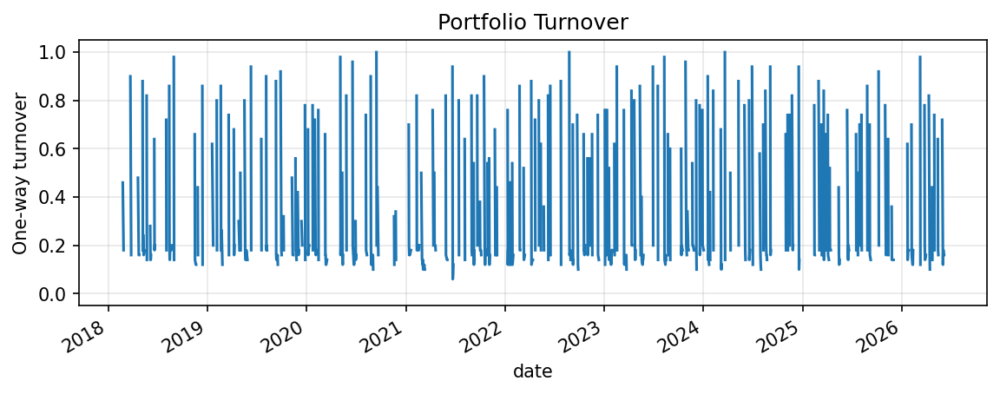
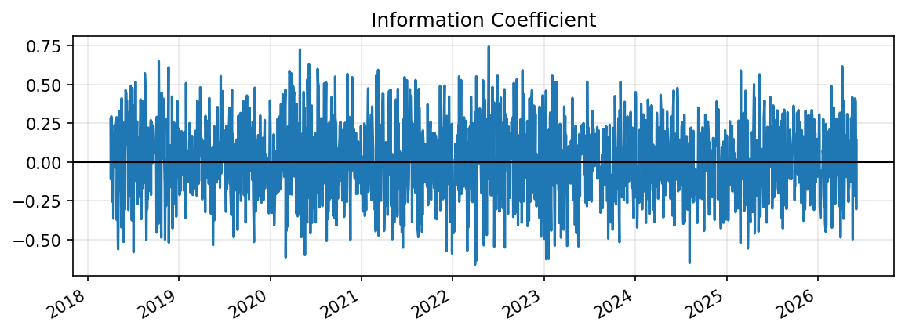
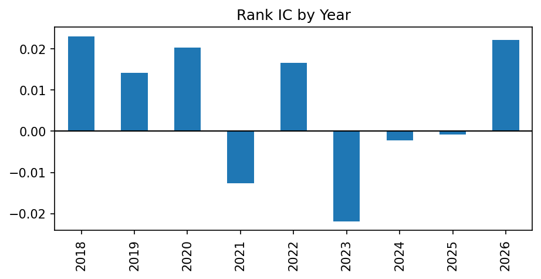
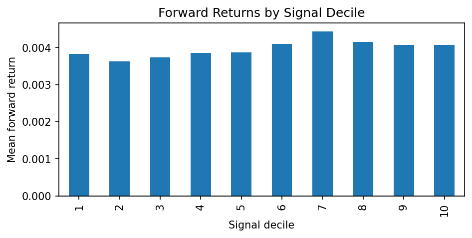
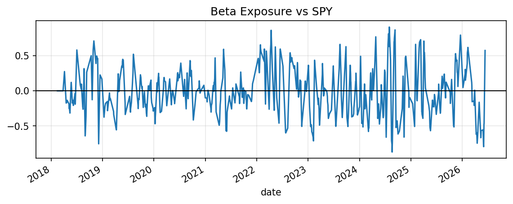

# Liquidity-Adjusted Reversal Research Report

This report is generated from local research artifacts. It intentionally does not hard-code performance claims.

## Generated Figures

## IC Summary

| metric | mean | std | t_stat | count |
| --- | --- | --- | --- | --- |
| pearson | 0.00237246 | 0.228665 | 0.470561 | 2057 |
| spearman | 0.00498025 | 0.235734 | 0.958177 | 2057 |

## Backtest Summary

| metric | 0 |
| --- | --- |
| annualized_return | 0.0599446 |
| annualized_volatility | 0.133461 |
| sharpe_ratio | 0.449155 |
| sortino_ratio | 0.618106 |
| max_drawdown | -0.20598 |
| hit_rate | 0.522463 |

## Naive Reversal Baseline

| metric | 0 |
| --- | --- |
| annualized_return | -0.119762 |
| annualized_volatility | 0.13039 |
| sharpe_ratio | -0.918495 |
| sortino_ratio | -1.32447 |
| max_drawdown | -0.702693 |
| hit_rate | 0.470061 |

## Interpretation

Review IC stability, decile monotonicity, turnover, drawdowns, and beta exposure before drawing any conclusion. The default result is a modest research candidate, not production-ready alpha. Results depend on the configured universe, sample period, transaction costs, and data quality.

## Disclaimer

This repository is for research and education only. It is not investment advice and does not include live trading or broker execution.
