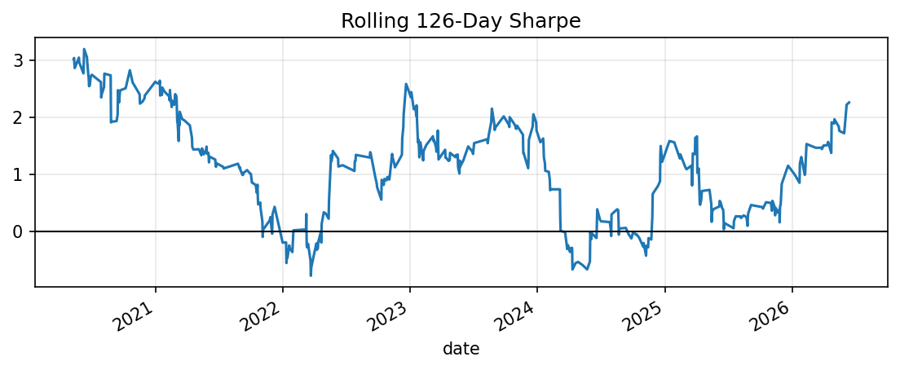

# Liquidity-Adjusted Reversal Research Report

This report is generated from local research artifacts. It intentionally does not hard-code performance claims.

## Generated Figures

## IC Summary

| metric | mean | std | t_stat | count |
| --- | --- | --- | --- | --- |
| pearson | 0.0168663 | 0.261266 | 2.92788 | 2057 |
| spearman | 0.0193712 | 0.254064 | 3.45805 | 2057 |

## Backtest Summary

| metric | 0 |
| --- | --- |
| annualized_return | 0.195163 |
| annualized_volatility | 0.127046 |
| sharpe_ratio | 1.53615 |
| sortino_ratio | 2.19513 |
| max_drawdown | -0.102241 |
| hit_rate | 0.549632 |

## Naive Reversal Baseline

| metric | 0 |
| --- | --- |
| annualized_return | -0.119762 |
| annualized_volatility | 0.13039 |
| sharpe_ratio | -0.918495 |
| sortino_ratio | -1.32447 |
| max_drawdown | -0.702693 |
| hit_rate | 0.470061 |

## Robustness Checks

| metric | base_feature | direction | vol_adjust | liquidity_threshold | horizon | holding_period | sleeves | train_rank_ic | train_rank_ic_t | test_rank_ic | test_rank_ic_t | test_ic_count | ann_return | ann_vol | sharpe | sortino | max_drawdown | hit_rate |
| --- | --- | --- | --- | --- | --- | --- | --- | --- | --- | --- | --- | --- | --- | --- | --- | --- | --- | --- |
| multi_sleeve_blend | blend | blend | False | 0 | 5 | 5 | {'reversal_5d': 0.8, 'residual_reversal_1d': 0.1, 'momentum_21d': 0.05, 'quality_proxy': 0.05} | 0.0304438 | 3.72617 | 0.00992462 | 1.29148 | 1110 | 0.195163 | 0.127046 | 1.53615 | 2.19513 | -0.102241 | 0.549632 |
| default_5d_reversal | return_5d | reversal | False | 0 | 5 | 5 |  | 0.0272775 | 3.3846 | 0.0127833 | 1.64164 | 1110 | 0.0599446 | 0.133461 | 0.449155 | 0.618106 | -0.20598 | 0.522463 |
| one_day_reversal | return_1d | reversal | False | 0 | 1 | 1 |  | 0.00489377 | 0.607159 | 0.00349436 | 0.432243 | 1114 | -0.121166 | 0.130787 | -0.926438 | -1.33682 | -0.702693 | 0.469805 |
| residual_1d_vol_adjusted | residual_1d_return | reversal | True | 0.4 | 1 | 1 |  | 0.00239028 | 0.26645 | -0.00555367 | -0.653609 | 1106 | -0.0130804 | 0.123484 | -0.105928 | -0.151129 | -0.224977 | 0.489231 |
| twenty_one_day_momentum | momentum_21d | momentum | False | 0 | 5 | 5 |  | -0.0147972 | -1.93167 | -0.0100634 | -1.28715 | 1110 | -0.00342768 | 0.132033 | -0.0259608 | -0.0362356 | -0.313932 | 0.502765 |

## Transaction Cost Sensitivity

| metric | annualized_return | annualized_volatility | sharpe_ratio | sortino_ratio | max_drawdown | hit_rate |
| --- | --- | --- | --- | --- | --- | --- |
| 0.0 | 0.244757 | 0.126931 | 1.92826 | 2.74813 | -0.0985967 | 0.551471 |
| 2.0 | 0.224919 | 0.126972 | 1.7714 | 2.52727 | -0.100056 | 0.551471 |
| 5.0 | 0.195163 | 0.127046 | 1.53615 | 2.19513 | -0.102241 | 0.549632 |
| 10.0 | 0.145569 | 0.127204 | 1.14438 | 1.64003 | -0.105871 | 0.538603 |
| 20.0 | 0.046381 | 0.127643 | 0.363365 | 0.523892 | -0.168846 | 0.509191 |

## Bootstrap Confidence Intervals

| metric | p05 | median | p95 |
| --- | --- | --- | --- |
| annualized_return | 0.0272207 | 0.164729 | 0.296186 |
| sharpe_ratio | 0.209649 | 1.30121 | 2.39354 |
| max_drawdown | -0.187837 | -0.108899 | -0.0673464 |

## Regime Summary

| metric | count | annualized_return | annualized_volatility | sharpe_ratio | sortino_ratio | max_drawdown | hit_rate |
| --- | --- | --- | --- | --- | --- | --- | --- |
| ('market_regime', 'negative_21d_trend') | 191 | -0.23537 | 0.128597 | -1.83029 | -2.14434 | -0.22779 | 0.47644 |
| ('market_regime', 'positive_21d_trend') | 353 | 0.428114 | 0.123926 | 3.4546 | 6.12471 | -0.0397335 | 0.589235 |
| ('vol_regime', 'high_vol') | 282 | 0.184218 | 0.152379 | 1.20895 | 1.73638 | -0.135226 | 0.535461 |
| ('vol_regime', 'low_vol') | 262 | 0.206944 | 0.0926321 | 2.23404 | 3.522 | -0.06324 | 0.564885 |

## Largest Drawdowns

| metric | start | trough | recovery | max_drawdown | days_to_trough | days_to_recovery |
| --- | --- | --- | --- | --- | --- | --- |
| 0 | 2025-02-12 | 2025-05-14 | 2026-04-23 | -0.102241 | 91 | 435 |
| 1 | 2020-06-19 | 2021-11-04 | 2022-05-13 | -0.0884392 | 503 | 693 |
| 2 | 2023-01-12 | 2023-05-22 | 2024-12-11 | -0.0791374 | 130 | 699 |
| 3 | 2018-07-02 | 2018-10-19 | 2018-11-26 | -0.0412804 | 109 | 147 |
| 4 | 2020-03-11 | 2020-03-23 | 2020-03-24 | -0.0282847 | 12 | 13 |

## Interpretation

The selected multi-sleeve blend has positive full-sample IC, positive pre/post split rank IC, stronger Sharpe and drawdown than the pure reversal sleeve, and remains positive across the displayed transaction-cost stress range. Bootstrap intervals and rolling diagnostics make the result easier to audit. Regime analysis shows the strategy is materially stronger in positive 21-day market trends and weaker in negative trend regimes, so the evidence is stronger than the single-sleeve baseline but still not production proof.

## Disclaimer

This repository is for research and education only. It is not investment advice and does not include live trading or broker execution.
