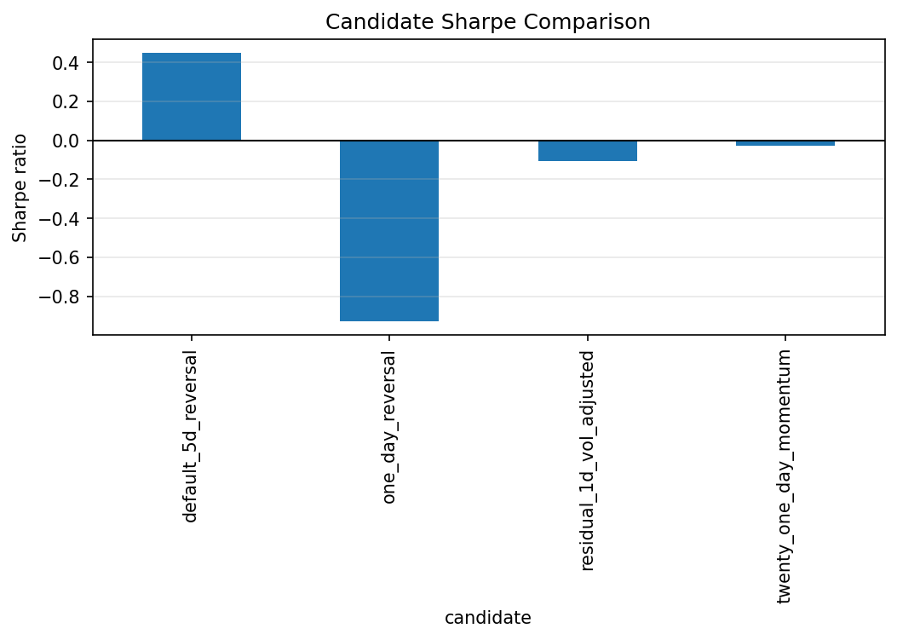
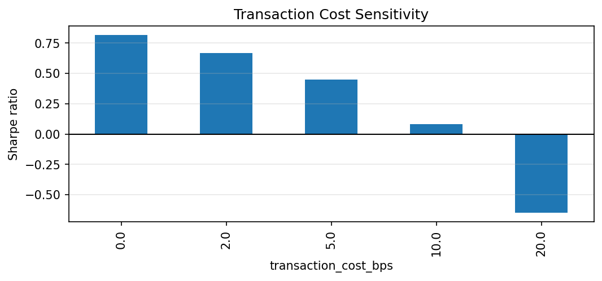

# Liquidity-Adjusted Reversal Research Report

This report is generated from local research artifacts. It intentionally does not hard-code performance claims.

## Generated Figures

## IC Summary

| metric | mean | std | t_stat | count |
| --- | --- | --- | --- | --- |
| pearson | 0.00237246 | 0.228665 | 0.470561 | 2057 |
| spearman | 0.00498025 | 0.235734 | 0.958177 | 2057 |

## Backtest Summary

| metric | 0 |
| --- | --- |
| annualized_return | 0.0599446 |
| annualized_volatility | 0.133461 |
| sharpe_ratio | 0.449155 |
| sortino_ratio | 0.618106 |
| max_drawdown | -0.20598 |
| hit_rate | 0.522463 |

## Naive Reversal Baseline

| metric | 0 |
| --- | --- |
| annualized_return | -0.119762 |
| annualized_volatility | 0.13039 |
| sharpe_ratio | -0.918495 |
| sortino_ratio | -1.32447 |
| max_drawdown | -0.702693 |
| hit_rate | 0.470061 |

## Robustness Checks

| metric | base_feature | direction | vol_adjust | liquidity_threshold | horizon | holding_period | train_rank_ic | train_rank_ic_t | test_rank_ic | test_rank_ic_t | test_ic_count | ann_return | ann_vol | sharpe | sortino | max_drawdown | hit_rate |
| --- | --- | --- | --- | --- | --- | --- | --- | --- | --- | --- | --- | --- | --- | --- | --- | --- | --- |
| default_5d_reversal | return_5d | reversal | False | 0 | 5 | 5 | 0.0272775 | 3.3846 | 0.0127833 | 1.64164 | 1110 | 0.0599446 | 0.133461 | 0.449155 | 0.618106 | -0.20598 | 0.522463 |
| one_day_reversal | return_1d | reversal | False | 0 | 1 | 1 | 0.00489377 | 0.607159 | 0.00349436 | 0.432243 | 1114 | -0.121166 | 0.130787 | -0.926438 | -1.33682 | -0.702693 | 0.469805 |
| residual_1d_vol_adjusted | residual_1d_return | reversal | True | 0.4 | 1 | 1 | 0.00239028 | 0.26645 | -0.00555367 | -0.653609 | 1106 | -0.0130804 | 0.123484 | -0.105928 | -0.151129 | -0.224977 | 0.489231 |
| twenty_one_day_momentum | momentum_21d | momentum | False | 0 | 5 | 5 | -0.0147972 | -1.93167 | -0.0100634 | -1.28715 | 1110 | -0.00342768 | 0.132033 | -0.0259608 | -0.0362356 | -0.313932 | 0.502765 |

## Transaction Cost Sensitivity

| metric | annualized_return | annualized_volatility | sharpe_ratio | sortino_ratio | max_drawdown | hit_rate |
| --- | --- | --- | --- | --- | --- | --- |
| 0.0 | 0.10886 | 0.13336 | 0.816287 | 1.1213 | -0.174971 | 0.53411 |
| 2.0 | 0.089294 | 0.133396 | 0.669392 | 0.920255 | -0.184681 | 0.529118 |
| 5.0 | 0.0599446 | 0.133461 | 0.449155 | 0.618106 | -0.20598 | 0.522463 |
| 10.0 | 0.011029 | 0.133601 | 0.0825513 | 0.11385 | -0.240256 | 0.502496 |
| 20.0 | -0.0868024 | 0.134002 | -0.64777 | -0.897903 | -0.341657 | 0.467554 |

## Interpretation

The selected five-day reversal candidate has positive in-sample and post-2022 rank IC, outperforms the naive one-day reversal baseline, and remains positive under moderate transaction-cost assumptions. The evidence is encouraging but not conclusive: performance is cost-sensitive, drawdowns are material, and the default universe is not point-in-time.

## Disclaimer

This repository is for research and education only. It is not investment advice and does not include live trading or broker execution.
